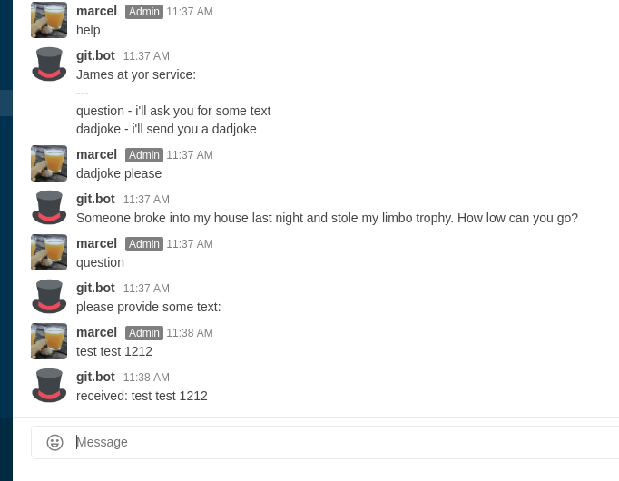

[](https://jitpack.io/#Ingwersaft/James)
[  ](https://bintray.com/ingwersaft/JamesBot/JamesBot/_latestVersion)
[](https://circleci.com/gh/Ingwersaft/James)

# James
Micro chat framework for Kotlin.

Currently supports Rocket.Chat, Telegram and Slack as targets.

Regarding *compatibility*:

**before 1.0.5**: kotlin 1.2 with old experimental coroutines
**since 1.0.5**: kotlin 1.3 with new coroutines (structured concurrency)
## Features
 * Rocket.Chat via Websocket api
 * Telegram
 * Slack using [Ullink/simple-slack-api](https://github.com/Ullink/simple-slack-api)
 * minimal DSL
 * conversation support
 * automatic mapping overview aka `help`
 * Name your bot
 * conversation support with retries
 
## Usage
With...
```kotlin
fun main(args: Array<String>) {
    james {
        
        abortKeywords += "cancel"
        abortKeywords += "abort"
                
        rocketchat {
                        websocketTarget = "wss://example.org/websocket"
                        username = "example_bot"
                        password = "secret_password"
                        sslVerifyHostname = false
                        ignoreInvalidCa = true
        }    
        name = "felix"
        map("question", "i'll ask you for some text") {
            val answer = ask("please provide some text:")
            send("received: $answer")
        }
        map("dadjoke", "i'll send you a dadjoke") {
            send("Someone broke into my house last night and stole my limbo trophy. How low can you go?")
        }
    }
}
```
... you get:



**Take a look at the [wiki](https://github.com/Ingwersaft/James/wiki) or the [Mapping.kt](https://github.com/Ingwersaft/James/blob/master/src/main/kotlin/com/mkring/james/mapping/Mapping.kt) source for all possibilities**

## Target chat specifics
the `send` and `ask` methods support optional options:
```kotlin
// Mapping:
fun send(text: String, options: Map<String, String> = emptyMap())
fun ask(text: String, options: Map<String, String> = emptyMap())
```

### Rocket.Chat
Change avatar (default `:tophat:`):
```kotlin
options.put("avatar",":alien:")
```

### Telegram
Parsemode (`HTML` or `Markdown` supported)
```kotlin
options["parse_mode"] == "Markdown"
```
Commands:
Every String with a leading `/` is clickable inside telegram. This can be used in your mapping string, but also if you ask
a user some question, you can provide possible, clickable, values.
 
## How to get James
James is published at [jcenter](https://bintray.com/ingwersaft/JamesBot/JamesBot) and [JitPack](https://jitpack.io/#Ingwersaft/James).
### Gradle
```groovy
allprojects {
    repositories {
        jcenter()
        ...or...
        maven { url 'https://jitpack.io' }
    }
}
...
dependencies {
    compile 'com.github.Ingwersaft:James:<Tag>'
}
```
### Maven
```xml
<repositories>
    <repository>
        <id>jitpack.io</id>
        <url>https://jitpack.io</url>
    </repository>
    ...or...
    <repository>
        <id>central</id>
        <name>bintray</name>
        <url>https://jcenter.bintray.com</url>
    </repository>
</repositories>
...
<dependency>
    <groupId>com.github.Ingwersaft</groupId>
    <artifactId>James</artifactId>
    <version>#VERSION#</version>
</dependency>
```

### Javadoc
Jitpack also provides javadoc web publishing. Use the URL
`https://jitpack.io/com/github/Ingwersaft/James/<VERSION>/javadoc/`
(e.g.: [master-SNAPSHOT](https://jitpack.io/com/github/Ingwersaft/James/master-SNAPSHOT/javadoc/)
or [1.0.5](https://jitpack.io/com/github/Ingwersaft/James/1.1.5/javadoc/))
to access the javadoc for the given version.

## Build
```
$ git clone https://github.com/Ingwersaft/James.git && cd James
$ ./gradlew build
```

## Known caveats
 * James doesn't execute retries in case of backend connection problems
